<p align="center"></p>
<h1 align="center">Hit Your Targets</h1>
<h3 align="center">A todo list for the meticulous</h2>

<p align="center"><a href="https://app.netlify.com/sites/eloquent-visvesvaraya-83fcf0/deploys" target="_blank"></a></p>

<p align="center">Preview the app <a href="https://www.hityourtargets.xyz">here</a></p>

<p align="center"><em>Zhu Hanming</em>&nbsp;&nbsp;|&nbsp;&nbsp;<em>A0196737L</em></p>

## Basic Overview
A todo list that revolves around task and subtask management, Hit Your Targets aims (pun intended) to fill the gap in the market, and be a precise tool for users to plan every single detail of their life out. Armed with three different views for users organise their day to day activities, Hit Your Targets guarantees to help you, well, **hit your targets**.

<br/>
<p align="center">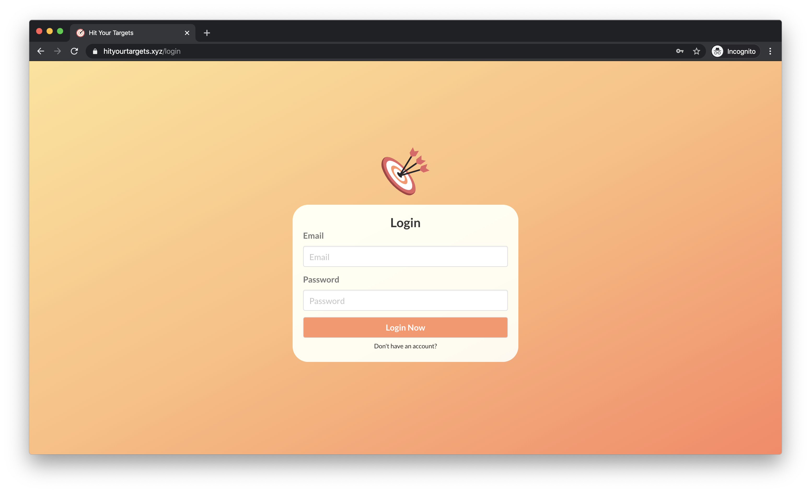&nbsp;&nbsp;&nbsp;&nbsp;&nbsp;&nbsp;&nbsp;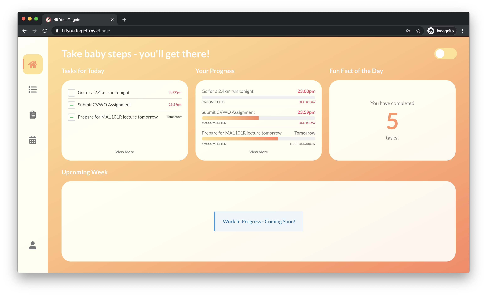</p>
<p align="center">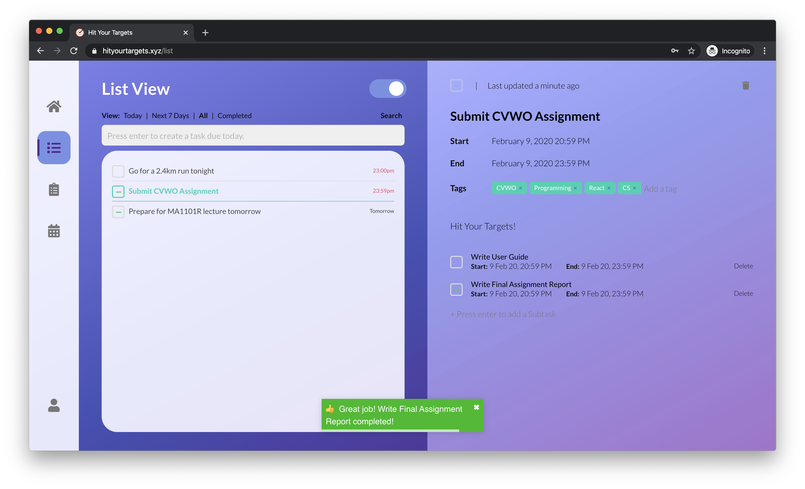&nbsp;&nbsp;&nbsp;&nbsp;&nbsp;&nbsp;&nbsp;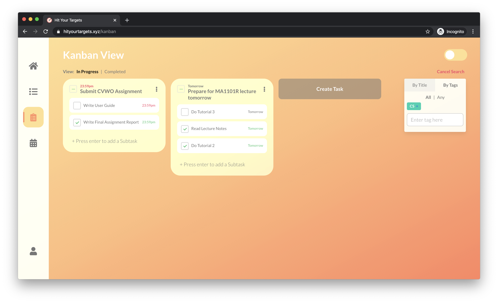</p>
<p align="center">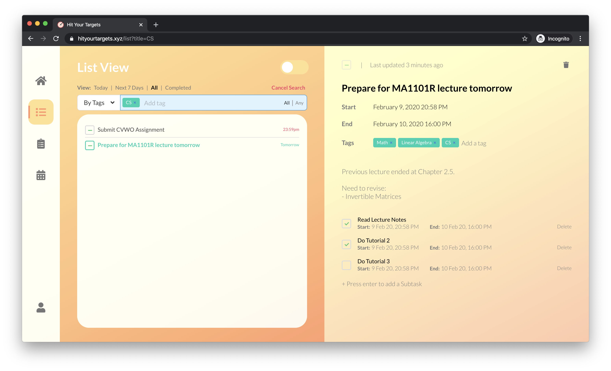&nbsp;&nbsp;&nbsp;&nbsp;&nbsp;&nbsp;&nbsp;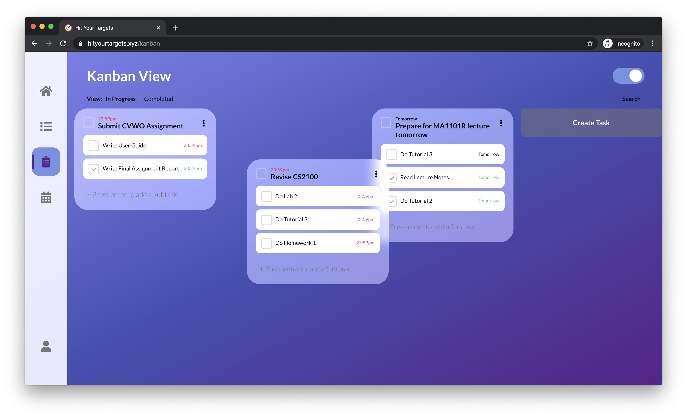</p>
<br/>

### Upcoming Features
* Calendar View

## Cloning this repository
Note that git repositories with submodules are handled differently by git and cannot be cloned directly. Please use the command

```git
git clone --recursive git@github.com:zhuhanming/cvwo.git
```
to clone this repository.

If you have already cloned the repository without the `--recursive` flag, you might find that the submodule folders are empty. To fix that, run

```git
git submodule update --init --recursive
```
in the repository folder to pull the submodules.

### READMEs
The various READMEs can be found in their respective folders.

This repository consists of two submodules:

1. `hit-your-target-frontend` contains the code for the frontend, hosted at [https://www.hityourtargets.xyz](https://www.hityourtargets.xyz)
2. `hit-your-target-api` contains the code for the backend, hosted at [https://api2.hityourtargets.xyz](https://api2.hityourtargets.xyz)

### Final Submission
The files for the final submission can be found in `final-submission`.

It contains:
1. [Final Assignment PDF Report](final-submission/final-assignment-report.pdf)
2. [User Guide PDF](final-submission/final-user-guide.pdf)
3. [User Guide Markdown](final-submission/final-user-guide.md)
4. [Final DB Schema](final-submission/final-db-schema.pdf)

<p align="center">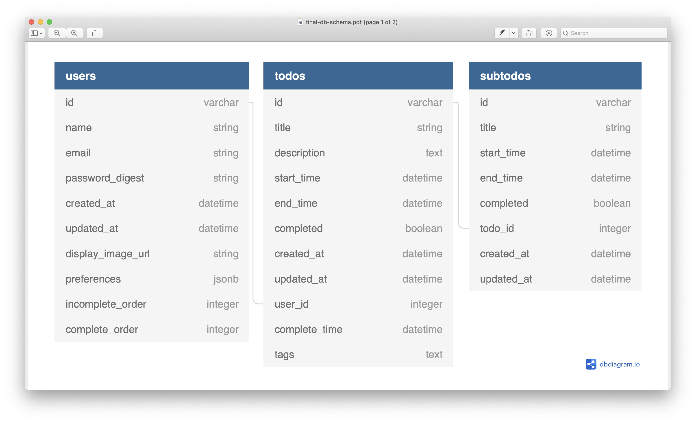</p>

### Mid-Submission
The files for the mid-submission can be found in `mid-submission`.

It contains:

1. [Mid-Assignment PDF Report](mid-submission/mid-assignment-report.pdf)
2. [Rails Startup Screen](mid-submission/rails-screenshot.png)

<p align="center">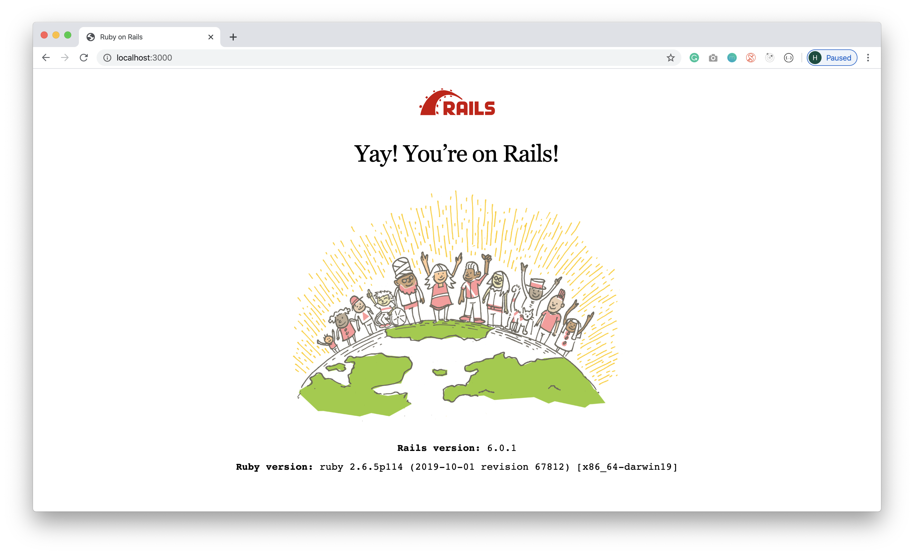</p>

### Designs and Assets
The remaining files can be found under `mockups` and `assets`. They contain the digital assets and mockups created by me throughout this project. The original Adobe XD mockup files can also be found inside.

1. [Adobe XD Mockup](mockups/mockup%20caa%20120120.xd)

#### Sample Mockups
<p align=center>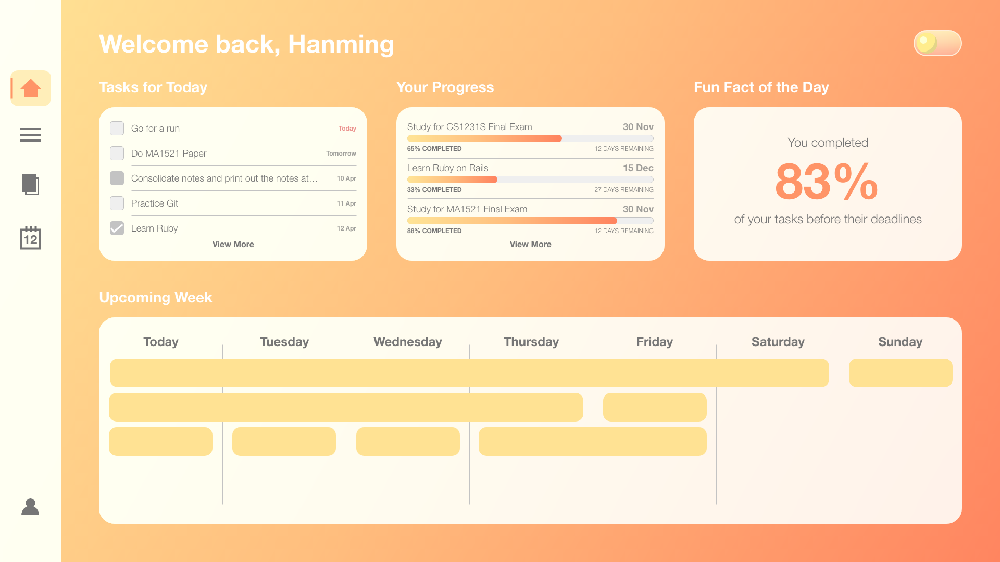&nbsp;&nbsp;&nbsp;&nbsp;&nbsp;&nbsp;&nbsp;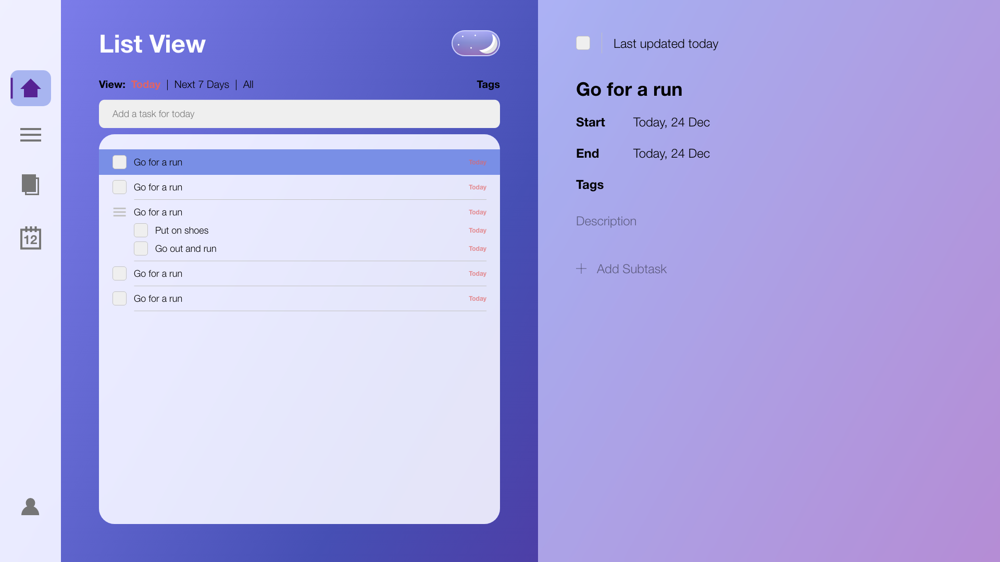&nbsp;&nbsp;&nbsp;&nbsp;&nbsp;&nbsp;&nbsp;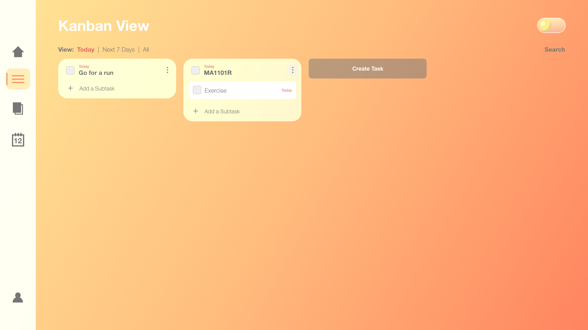</p>
