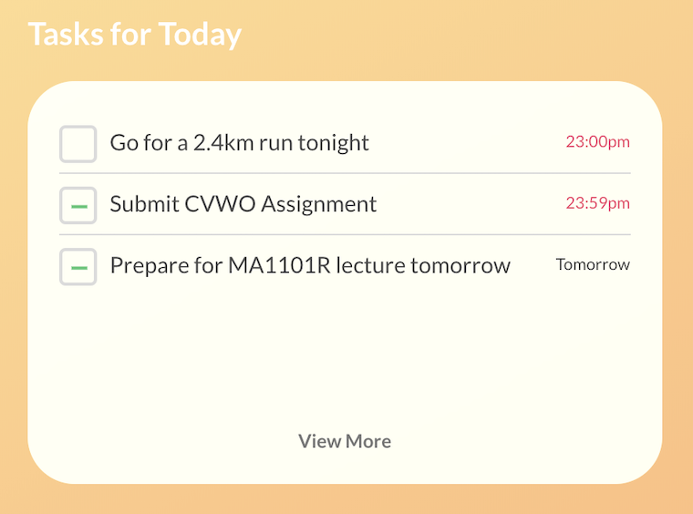
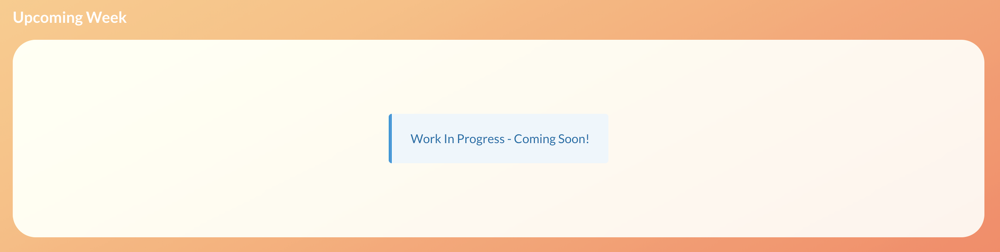

# Hit Your Targets User Guide

Welcome to Hit Your Targets! Here at HYT, we **aim** to help you, well, hit your targets!

Get started now at [https://www.hityourtargets.xyz](https://www.hityourtargets.xyz)!

[Hit Your Targets](https://www.hityourtargets.xyz)

## Contents

1. [Sign Up and Login](https://www.notion.so/hanming/Hit-Your-Targets-User-Guide-cdae91735d34460686c327dfc37468f0#f3170b2ec0f145e18ddd6671314303a1)
2. [Understanding the Main View](https://www.notion.so/hanming/Hit-Your-Targets-User-Guide-cdae91735d34460686c327dfc37468f0#f841b1d1ddcf4946bc5a6a9d15c667f6)
3. [Understanding the List View](https://www.notion.so/hanming/Hit-Your-Targets-User-Guide-cdae91735d34460686c327dfc37468f0#4d828a8ef50949edbd040dd6a6aa7836)
    1. [Creating Your First Task!](https://www.notion.so/hanming/Hit-Your-Targets-User-Guide-cdae91735d34460686c327dfc37468f0#de95d763c99f486883464a88060c29da)
4. [Understanding the Kanban View](https://www.notion.so/hanming/Hit-Your-Targets-User-Guide-cdae91735d34460686c327dfc37468f0#a84e7cb72cf946b8a952164bac0a7432)
    1. [Subtask Creation - Break Your Tasks into Bite-Sized Pieces!](https://www.notion.so/hanming/Hit-Your-Targets-User-Guide-cdae91735d34460686c327dfc37468f0#e70615422c4844f796104249e82b675b)
    2. [Tagging Your Tasks](https://www.notion.so/hanming/Hit-Your-Targets-User-Guide-cdae91735d34460686c327dfc37468f0#18ef8ff27aa549f88a9642918f6f8f34)
5. [Searching Through Tasks](https://www.notion.so/hanming/Hit-Your-Targets-User-Guide-cdae91735d34460686c327dfc37468f0#f1fdd50178524c67a209d55cd0d9e4d4)
    1. [Kanban View](https://www.notion.so/hanming/Hit-Your-Targets-User-Guide-cdae91735d34460686c327dfc37468f0#40ef128381624f19b56310089de0d026)
    2. [List View](https://www.notion.so/hanming/Hit-Your-Targets-User-Guide-cdae91735d34460686c327dfc37468f0#a2e2c2009b23481394afc92d7295fb0a)
6. [Viewing on Mobile](https://www.notion.so/hanming/Hit-Your-Targets-User-Guide-cdae91735d34460686c327dfc37468f0#c92a829fa7bb4fa5a10360f660ed0658)
7. Logging Out

## Sign Up and Login

Upon heading over to the Hit Your Targets app, you should see the following landing screen:

Simple click on "Don't have an account?" to get started with account creation!

Enter your name (no worries, it can be a nickname), your email, and a password with length longer than 8 characters!

Once done, you should be automatically logged in, and you'll see the Main view.

## Understanding the Main View

You should be seeing the following dashboard:

Let us take a look at each of these sections of the Main view:

### Tasks for Today

The tasks for today condenses for you the tasks you have left for today.

They are ranked according to their due date - the higher up they are, the earlier they are due.

You can directly complete your tasks from here, simply by checking the box.

The tasks with the line in their checkboxes are ones with subtasks. More will be covered later.

### Your Progress

This section gives you a rough overview of your progress with your tasks. These progress bars are calculated based on the percentage of subtasks completed - the more you have completed, the closer you are to completion!

Tasks without subtasks are also reflected, except that they only have two states - 0% completed with an empty bar, or 100% completed with a full bar.

### Fun Fact of the Day

The Fun Fact of the Day, as the name suggests, gives you a fun fact every day!

This can range from fun facts about your tasks and subtasks, to fun facts about todo lists and Hit Your Targets!

Do keep an eye out on this section every day!

### Upcoming Week

A current work in progress, the Upcoming Week section gives you an overview of your tasks for the coming week in a calendar view! 

Stay tuned for updates!

### Miscellaneous Features

You might have noticed that there is a cute toggle at the top right corner of your screen. What might it do? Give it a click to find out!

## Understanding the List View

Now that we've taken a look at the Main view, let us take a look at the List view!

You can access the List view through the second button from the top on the left-hand menu!

Click it! You should see the below screen:

Woah! What happened? Why is the interface purple?

Nothing to worry about here, we simply clicked on the toggle from before to switch to the Dark Theme! Clicking it again will bring us back to the Light Theme.

Let us explore the List view together.

### List

As the name suggests, the List view has a List! The List contains your tasks, which you can click on to view in greater detail via the Task Body.

### Task Body

The left side of your screen is the List, while the right side acts as the Task Body. Selecting any task on the List allows you to view the task in greater detail via the Task Body.

We shall experiment more with this subsequently, let us continue with the rest of the parts of the List view.

### View Selector

The View Selector allows you to filter the tasks you see in your List. Let's say you're only interested in tasks due today or earlier - clicking on **Today** will immediately show you that.

Or perhaps you're interested in the tasks due this week. No worries, just click on **Next 7 Days**!

Selecting **All** will show you all **incomplete** tasks, while selecting **Completed** will show you all completed tasks.

### Search

The Search button enables the Search mode for the app. Entering the Search mode will allow you to search through your tasks. More will be touched upon later.

### Task Creation Bar / Search Bar

When you're not in the Search mode, typing into the Task Creation Bar and pressing Return / Enter will immediately create a Task with your input as title.

When you're in Search mode, the bar acts as a Search Bar instead - more will be covered later.

Let us try creating a Task together!

## Creating Your First Task!

Let us create a task together! Simply type something into the Task Creation Bar and press enter.

Let us create a task named "Go to the market" while under the **Today** view.

As we created this task under the **Today** view, we will see the deadline to be end of today. Creating it under the **Next 7 Days** view will give you a deadline of 7 days. Creating it under **All** or **Completed** will both give you a task due today.

Let us now click on the task.

As we can now see on the right side, the details of the task are there. Let's say we want to change it to "Go to the supermarket". Simply clicking the title and typing "super" before the market gives us the change we want. Click out of the title to save.

Similarly, we can do the same to the description. Let us now add a list of things we need:

It's as simple as that!

If we want to change the due date, simply click on the due date and set it to be what we want.

We will come back to the rest of the features later.

## Understanding the Kanban View

Let us head over to the Kanban view now. Click on the third button on the left-hand menu to navigate to the Kanban View.

You should see the screen below:

You see that our previous "Go to the supermarket" is still there! Indeed, the different views are just different ways to visualise your tasks - choose one that suits you the most!

Let us run through the features once again.

### View Selector

First thing you might notice is that the View Selector now only has two views! Indeed, you can now only see your incomplete tasks and completed tasks. "Why?" you might ask.

Well, this is because in Kanban view, we support personalised ordering. In other words, you can reorder the tasks as you like! This is done through the Kanban Board.

### Kanban Board

What you see on the right is your board of tasks. You can scroll through your tasks horizontally, and easily reorder your tasks simply by dragging and dropping!

Each of your tasks is now a Task Panel.

Here's an example:

It's that easy!

### Task Creation Panel

Similarly, we support task creation from the Kanban View. This is done by clicking the Task Creation Panel with the words "Create Task" on it. 

Clicking it will give you the field to type in your task title. Clicking Submit or pressing Return will create your task immediately.

## Subtask Creation - Break Your Tasks into Bite-Sized Pieces!

Let us create a Subtask now.

Hit Your Targets operates on a very simple principle - tasks can be tasks in themselves, or can be containers for smaller subtasks. Once a subtask is added to a task, the task's completion status depends solely on the subtasks - i.e., once you complete all subtasks, a task is automatically completed. Conversely, any incomplete subtask means that the task is incomplete.

So now let us try creating a subtask.

In the Kanban view, this can be easily done by simply typing into the field at the bottom of your Task Panel. Pressing return will instantly create the subtask.

It's that easy!

Let us try the usual way of creation - via the Task Body. You can access the Task Body by clicking the vertical ellipsis at the top right of each Task Panel.

To create a subtask in this view, simply type into the field at the bottom and press Return / Enter just like before.

## Tagging Your Tasks

Now, how can we better categorise our tasks? One way is to tag it with an appropriate tag, to facilitate easier searching next time.

Let us try tagging our task. Let's tag it "Shopping".

As always, pressing Return / Enter immediately creates the tag and adds it to the task. It's that simple!

## Searching Through Tasks

### Kanban View

Let us now find out how we can search through our tasks. First, let us do so in Kanban view.

To start our search, we first click the Search button at the top right of the screen.

Woah! What's this dropdown menu?

In Kanban view, entering Search mode will cause the dropdown menu to show, which allows you to search in Kanban view.

Let us first search for "supermarket".

There seems to be no difference! But what if we change it to "supermarket**s**"?

Our Kanban Board is now sadly empty. Indeed, as you can see, searching is done live, and updates with every letter you enter.

Let us now search by tag instead. To do so, click By Tags.

You'd notice that the dropdown changes slightly. There's now an All or Any selection.

Let us first search for the tag "Shopping". Key that in and press Return / Enter.

The Kanban Board once again seems to have not changed. But what if we add another tag?

Let us add "Buying" as a tag now.

Our task disappears! This is because we are currently searching for tasks that contain **All** of the tags we have keyed in. Since our previous task only had "Shopping" as a tag, we can't find it.

What if we want to find tasks with either "Shopping" or "Buying" as a tag?

To do so, we just need to switch over to **Any**! Click **Any** to see how it works!

Woah! Our task just reappeared! Since our task had "Shopping" as a tag, it naturally fits the criteria.

### List View

Similarly, we can search in the List view. **Without clicking Cancel Search**, change over to the List view via the menu on the left-hand side!

We see that our search options actually carried over to the List view!

Indeed, a core principle of Hit Your Targets is to ensure that the integration between different views is seamless, allowing you to switch between different views with ease, without losing whatever you have done in the previous view.

Similarly, we can toggle between **All** and **Any** via the options at the right of the Search Bar. To switch between searching by tags and searching by title, simple click the dropdown on the left side of the Search Bar and select the desired option!

Everything in Hit Your Targets is built to be seamless and intuitive for you. We are, after all, here to help you hit your targets with ease.

## Viewing on Mobile

Hit Your Targets is also fully mobile responsive. Simply launch our site with your phone to resume where you left off on your computer.

Here are some screenshots of how it looks:

The key difference lies in how the Todo Body looks like. Unlike the split screen of the desktop List view or the pop-up of the desktop Kanban view, the Todo Body now takes up the entire screen.

Now you can hit your targets, both at home and outside!

## Logging Out

Lastly, we have logging out. To log out, simply click on the Profile icon at the bottom left of the menu to access the Settings view.

On the Settings view, simply click the Logout button to log out.

All user information and task information will be cleared from your local computer. Everything, however, will be saved on our servers, so don't worry.

Thank you and we wish you happy target-hitting!

